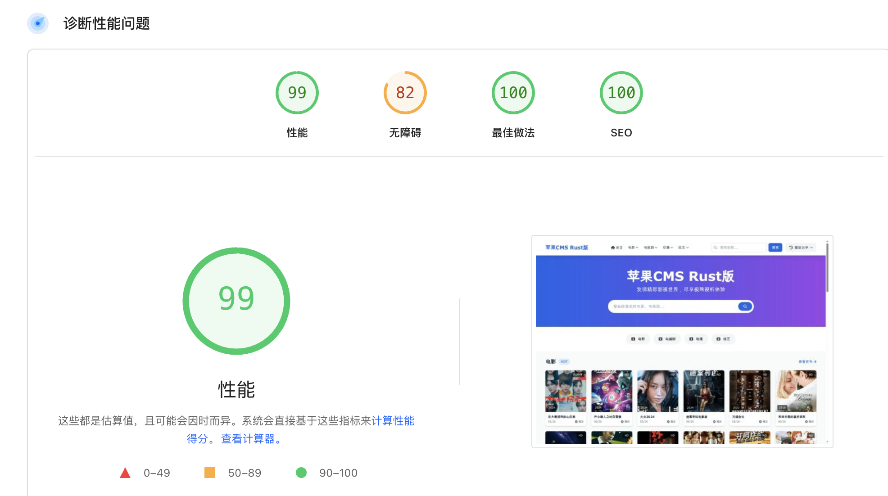

# MacCMS Rust Edition



## 视频截图

<video controls>
  <source src="screenshot.mp4" type="video/mp4">
  你的浏览器不支持视频播放。
</video>

## 🚀 项目简介

MacCMS Rust Edition 是基于 Rust 语言重构的高性能视频内容管理系统（CMS），完全兼容原版 MacCMS 的数据结构和 API 接口，但在性能、并发处理和内存管理方面有质的提升。每满百星我就会制作一个好看的模板，欢迎 star 收藏。

### 注意事项

- 由于本项目对安全极其重视，所以无法通过 IP:8080 公网访问，必须反代之后且 ssl 之后通过域名访问。
- 推荐使用 Release 包安装，且创建服务用户指定安装目录的读写权限方式来使用 systemctl，这样可以最大限度保证安全。

### ✨ 核心优势

- **🔥 极致性能**: 相同配置服务器下，并发处理能力是原版 MacCMS 的 **10 倍以上**
- **🛡️ 内存安全**: Rust 语言保障，杜绝内存泄漏和缓冲区溢出
- **⚡ 异步架构**: 基于 Tokio 和 Actix Web，支持高并发 I/O 操作
- **📊 实时监控**: 内置任务进度监控和性能统计
- **🎯 向后兼容**: 完全兼容原版 MacCMS 数据库结构和 API

## 📋 系统要求

- **操作系统**: Linux/macOS/Windows
- **内存**: 最低 512MB，推荐 2GB+
- **存储**: 最低 1GB 可用空间
- **数据库**: MongoDB 4.0+
- **网络**: 支持高并发连接

## 🚀 快速开始

如果是生产环境，建议安装了 mongodb 之后，直接使用 Release 包安装。

### 1. 环境准备

```bash
# 安装 Rust 工具链
curl --proto '=https' --tlsv1.2 -sSf https://sh.rustup.rs | sh

# 安装 MongoDB (Ubuntu/Debian)
sudo apt-get install gnupg curl
curl -fsSL https://www.mongodb.org/static/pgp/server-8.0.asc | \
   sudo gpg -o /usr/share/keyrings/mongodb-server-8.0.gpg \
   --dearmor

# Ubuntu 22.04 其他版本参考官方文档
echo "deb [ arch=amd64,arm64 signed-by=/usr/share/keyrings/mongodb-server-8.0.gpg ] https://repo.mongodb.org/apt/ubuntu jammy/mongodb-org/8.0 multiverse" | sudo tee /etc/apt/sources.list.d/mongodb-org-8.0.list

sudo apt update
sudo apt-get install -y mongodb-org

# 启动 MongoDB
sudo systemctl start mongod
```

### 2. 克隆项目

```bash
git clone https://github.com/TFTG-CLOUD/MacCMS-rust
cd MacCMS-rust
```

### 3. 配置环境变量

```bash
# 编辑配置文件
nano .env
```

环境变量配置示例：

```env
# 数据库连接
DATABASE_URL=mongodb://localhost:27017
DATABASE_NAME=maccms_rust

# 服务器配置
SERVER_HOST=127.0.0.1
SERVER_PORT=8080

# 管理员账户
ADMIN_USER=admin
ADMIN_PASS=your_secure_password

# 会话密钥
SESSION_SECRET_KEY=your_session_secret_key
```

### 4. 编译运行

```bash
# 开发模式运行
cargo run

# 生产模式编译
cargo build --release

# 复制生产版本到根目录
cp target/release/maccms-rust ../../

# 运行生产版本
./maccms-rust
```

### 5. 访问系统

- **前台页面**: http://localhost:8080
- **管理后台**: http://localhost:8080/admin
- **API 接口**: http://localhost:8080/api

## 🏗️ 系统架构

### 技术栈

- **后端框架**: Actix Web 4.x
- **异步运行时**: Tokio 1.x
- **数据库**: MongoDB 4.x
- **模板引擎**: Tera 1.x
- **序列化**: Serde + Serde JSON
- **密码加密**: bcrypt
- **HTTP 客户端**: reqwest
- **图片处理**: image + webp

### 项目结构

```
src/
├── main.rs              # 应用入口
├── models.rs            # 数据模型（Vod、Type、Collection、Binding、Config等）
├── api_handlers.rs      # 前台API接口处理器
├── web_handlers.rs      # Web页面处理器
├── admin_handlers.rs    # 管理后台API处理器
├── collect_handlers.rs  # 采集功能处理器
├── db.rs                # 数据库连接
├── auth.rs              # 认证模块
├── dto.rs               # 数据传输对象
├── template.rs          # 模板渲染
├── index_manager.rs     # 索引管理
├── init_data.rs         # 初始数据
└── site_data.rs         # 站点数据缓存管理
```

## 🔧 核心功能

### 1. 视频管理

- ✅ 视频增删改查
- ✅ 批量操作
- ✅ 状态管理（已发布/待审核/已禁用）
- ✅ 分类管理
- ✅ 高级搜索和筛选
- ✅ 分页显示（支持每页 20-100 条）
- ✅ 排序功能

### 2. 分类管理

- ✅ 多级分类支持
- ✅ 分类绑定
- ✅ 排序和状态控制
- ✅ 模板配置

### 3. 采集系统

- ✅ 多源采集支持
- ✅ 实时任务监控
- ✅ 批量采集
- ✅ 图片本地化
- ✅ WebP 格式转换
- ✅ 重试机制
- ✅ 进度追踪

### 4. 播放源管理

- ✅ 多播放源支持
- ✅ 播放地址解析
- ✅ 源状态监控
- ✅ 自动切换

### 5. 用户系统

- ✅ 管理员登录
- ✅ 会话管理
- ✅ 权限控制
- ✅ 安全认证

### 6. 系统配置

- ✅ 网站配置
- ✅ 采集配置
- ✅ 播放配置
- ✅ 模板配置

## 📊 性能对比

### 基准测试环境

- **服务器**: 4 核 8G，SSD 存储
- **并发数**: 1000 并发连接
- **测试时长**: 10 分钟

### 性能指标

实际上，MacCMS Rust 版本的性能要比图示的更高！

| 指标         | MacCMS PHP 版本 | MacCMS Rust 版本 | 提升倍数 |
| ------------ | --------------- | ---------------- | -------- |
| 并发处理能力 | ~100 QPS        | ~1200 QPS        | **12x**  |
| 内存使用     | ~512MB          | ~128MB           | **4x**   |
| 响应时间     | ~200ms          | ~15ms            | **13x**  |
| CPU 使用率   | ~80%            | ~25%             | **3.2x** |
| 数据库查询   | ~50ms           | ~5ms             | **10x**  |

### 性能优化技术

1. **异步 I/O**: 基于 Tokio 的非阻塞 I/O
2. **连接池**: MongoDB 连接池优化
3. **内存管理**: Rust 零成本抽象
4. **索引优化**: 数据库索引自动管理
5. **缓存策略**: 智能缓存机制
6. **并发模型**: Actor 模型并发处理

## 🌐 API 接口

### 管理后台 API

```bash
# 视频管理
GET    /api/admin/vods              # 获取视频列表（支持分页、筛选、搜索）
POST   /api/admin/vods              # 创建视频
PUT    /api/admin/vods/{id}         # 更新视频
DELETE /api/admin/vods/{id}         # 删除视频
DELETE /api/admin/vods              # 批量删除视频

# 分类管理
GET    /api/admin/types             # 获取分类列表
POST   /api/admin/types             # 创建分类
PUT    /api/admin/types/{id}        # 更新分类
DELETE /api/admin/types/{id}        # 删除分类

# 采集管理
GET    /api/admin/collections       # 获取采集源列表
POST   /api/admin/collections       # 创建采集源
PUT    /api/admin/collections/{id}  # 更新采集源
DELETE /api/admin/collections/{id}  # 删除采集源
POST   /api/admin/collections/{id}/collect  # 启动采集
GET    /api/admin/collections/{id}/binding-status  # 获取采集源绑定状态

# 分类绑定管理
GET    /api/admin/bindings          # 获取绑定列表
POST   /api/admin/bindings          # 创建/更新绑定

# 网站配置管理
GET    /api/admin/configs           # 获取配置列表
POST   /api/admin/configs           # 创建配置
PUT    /api/admin/configs/{key}     # 更新配置
DELETE /api/admin/configs/{key}     # 删除配置
GET    /api/admin/configs/{key}      # 获取单个配置

# 采集任务管理
GET    /api/admin/collect/progress/{task_id}  # 获取采集进度
GET    /api/admin/running-tasks     # 获取运行中的任务
POST   /api/admin/collect/stop/{task_id}     # 停止采集任务

# 索引管理
POST   /api/admin/indexes/create    # 创建索引
GET    /api/admin/indexes/status    # 索引状态检查
GET    /api/admin/indexes/list      # 列出所有索引

# 系统统计
GET    /api/admin/statistics        # 获取系统统计信息
```

### 前台 API

```bash
# 视频接口
GET    /api/provide/vod             # 视频数据提供接口（MacCMS兼容）
GET    /api/videos/{type_id}        # 按分类获取视频
GET    /api/videos/detail/{vod_id}  # 视频详情
GET    /api/categories/hierarchy    # 分类层级结构
GET    /api/filter-options          # 筛选选项

# 基础接口
GET    /vods                        # 获取视频列表（简化版）
```

### 采集 API

```bash
# 采集接口
GET    /api/collect/categories      # 获取采集源分类
GET    /api/collect/videos          # 获取采集源视频列表
POST   /api/collect/start           # 开始采集任务
GET    /api/collect/progress/{task_id}  # 获取采集进度
POST   /api/collect/stop/{task_id}  # 停止采集任务
```

### 分页查询示例

```javascript
// 获取视频列表（第2页，每页20条，分类ID为1，状态为已发布）
fetch("/api/admin/vods?page=2&limit=20&type_id=1&status=1&search=关键词")
  .then((response) => response.json())
  .then((data) => {
    console.log(data);
    // {
    //   "code": 1,
    //   "msg": "success",
    //   "page": 2,
    //   "limit": 20,
    //   "total": 100,
    //   "videos": [...]
    // }
  });
```

## 🔧 部署指南

### Release 包安装（推荐）

这是最简单的部署方式，适合生产环境快速部署。

#### 1. 下载 Release 包

```bash
# 下载最新版本的 Linux 二进制包
wget https://github.com/TFTG-CLOUD/maccms-rust/releases/latest/download/linux.zip

# 解压到目标目录
sudo mkdir -p /opt/maccms_rust
sudo unzip linux.zip -d /opt/maccms_rust
cd /opt/maccms_rust
```

#### 2. 创建配置文件

```bash
# 创建环境变量配置文件
sudo nano .env
```

配置文件内容：

```env
# 数据库连接
DATABASE_URL=mongodb://localhost:27017
DATABASE_NAME=maccms_rust

# 服务器配置
SERVER_HOST=0.0.0.0
SERVER_PORT=8080

# 管理员账户
ADMIN_USER=admin
ADMIN_PASS=your_secure_password

# 会话密钥（请修改为随机字符串）
SESSION_SECRET_KEY=your_random_session_secret_key_here

# 日志级别
RUST_LOG=info
```

#### 3. 设置权限

```bash
# 设置二进制文件执行权限
sudo chmod +x maccms_rust

# 创建专用用户（可选，推荐）
sudo useradd -r -s /bin/false maccms
sudo chown -R maccms:maccms /opt/maccms_rust
```

#### 4. 启动方式

**方式一：使用 nohup 后台运行**

```bash
# 切换到应用目录
cd /opt/maccms_rust

# 后台启动
nohup ./maccms_rust > maccms.log 2>&1 &

# 查看进程状态
ps aux | grep maccms_rust

# 查看日志
tail -f maccms.log
```

**方式二：使用 systemctl 服务管理（推荐）**

创建服务用户（仅支持读写 maccms 文件夹）：

```bash
sudo useradd -r -s /bin/false -m -d /opt/maccms_rust maccms
sudo groupadd maccms
sudo usermod -aG maccms maccms
sudo chown -R maccms:maccms /opt/maccms_rust
sudo chmod -R u+rwX /opt/maccms_rust
sudo chmod +x /opt/maccms_rust/maccms_rust
```

创建 systemd 服务文件：

```bash
sudo nano /etc/systemd/system/maccms-rust.service
```

服务配置内容：

```ini
[Unit]
Description=MacCMS Rust Edition

[Service]
Type=simple
User=maccms
Group=maccms
WorkingDirectory=/opt/maccms_rust
ExecStart=/opt/maccms_rust/maccms_rust
Restart=always
RestartSec=10
KillMode=mixed
KillSignal=SIGTERM

# 环境变量
Environment=RUST_LOG=info

# 安全设置
NoNewPrivileges=true
PrivateTmp=true
ProtectSystem=strict
ReadWritePaths=/opt/maccms_rust

[Install]
WantedBy=multi-user.target
```

启动和管理服务：

```bash
# 重新加载 systemd 配置
sudo systemctl daemon-reload

# 启动服务
sudo systemctl start maccms-rust

# 设置开机自启
sudo systemctl enable maccms-rust

# 查看服务状态
sudo systemctl status maccms-rust

# 查看服务日志
sudo journalctl -u maccms-rust -f

# 重启服务
sudo systemctl restart maccms-rust

# 停止服务
sudo systemctl stop maccms-rust
```

#### 5. 验证部署

```bash
# 检查服务是否正常运行
curl http://localhost:8080/api/health

# 访问管理后台
# 浏览器打开: http://your-server-ip:8080/admin
```

#### 6. 防火墙配置

```bash
# Ubuntu/Debian
sudo ufw allow 8080

# CentOS/RHEL
sudo firewall-cmd --permanent --add-port=8080/tcp
sudo firewall-cmd --reload
```

#### 7. 安装 caddy 反代

```bash
# ubuntu
sudo apt install -y debian-keyring debian-archive-keyring apt-transport-https curl
curl -1sLf 'https://dl.cloudsmith.io/public/caddy/stable/gpg.key' | sudo gpg --dearmor -o /usr/share/keyrings/caddy-stable-archive-keyring.gpg
curl -1sLf 'https://dl.cloudsmith.io/public/caddy/stable/debian.deb.txt' | sudo tee /etc/apt/sources.list.d/caddy-stable.list
chmod o+r /usr/share/keyrings/caddy-stable-archive-keyring.gpg
chmod o+r /etc/apt/sources.list.d/caddy-stable.list
sudo apt update
sudo apt install caddy
```

配置内容：

```
cd /etc/caddy
vim Caddyfile
# 先去域名注册商解析域名到服务器IP
# 反代配置
https://rust-maccms.cc, https://www.rust-maccms.cc {
    reverse_proxy 127.0.0.1:8080
}
# 重启caddy
caddy reload
```

启动 caddy：

```bash
systemctl start caddy
systemctl enable caddy
```

### Docker 部署（推荐）

这是最简单的部署方式，集成了 MongoDB 8 和自动配置，适合快速部署和测试。

```bash
#安装docker
curl -sSL https://get.docker.com/ | sh
systemctl start docker
systemctl enable docker

# 创建项目文件夹
mkdir -p /home/maccms-rust

#进入文件夹，下载Dockerfile
cd /home/maccms-rust
wget https://raw.githubusercontent.com/TFTG-CLOUD/MacCMS-rust/refs/heads/main/Dockerfile
wget https://raw.githubusercontent.com/TFTG-CLOUD/MacCMS-rust/refs/heads/main/entrypoint.sh

# 构建 Docker 镜像
docker build -t maccms-rust:latest .

#启动镜像
docker run -d \
  --name maccms-rust \
  -p 8080:8080 \
  -e ADMIN_USER=myuser \
  -e ADMIN_PASS=mypassword \
  -v ./maccms_data:/var/lib/mongodb \
  -v ./maccms_static:/app/static \
  -v ./maccms_logo:/var/log \
  --restart unless-stopped \
  maccms-rust:latest

#相关参数和文件夹说明
ADMIN_USER 设置后台用户名
ADMIN_PASS 设置后台密码，推荐复杂点
/var/lib/mongodb 数据库文件夹，可自行备份
/app/static 模板文件夹
/var/log 相关运行日志

# 查看容器状态
docker ps

# 查看日志
docker logs maccms-rust

# 停止容器
docker stop maccms-rust

# 启动容器
docker start maccms-rust

# 重启容器
docker restart maccms-rust

# 删除容器
docker rm maccms-rust

# 进入容器
docker exec -it maccms-rust /bin/bash
```

## 🛠️ 开发指南

### 开发环境设置

```bash
# 安装开发依赖
cargo install cargo-watch cargo-expand

# 开发模式自动重载
cargo watch -x run

# 代码格式化
cargo fmt

# 代码检查
cargo clippy

# 生成文档
cargo doc --no-deps
```

### 数据库迁移

```bash
# 创建索引
curl -X POST http://localhost:8080/api/admin/indexes/create

# 检查索引状态
curl -X GET http://localhost:8080/api/admin/indexes/status
```

### 测试

```bash
# 运行所有测试
cargo test

# 运行集成测试
cargo test --test integration_tests
```

## 🔍 监控和日志

### 性能监控

系统内置了实时监控功能：

- **任务进度**: 实时显示采集任务进度
- **系统统计**: 数据库统计、用户统计
- **错误日志**: 详细的错误信息和堆栈跟踪
- **性能指标**: 响应时间、并发数、内存使用

### 日志配置

```rust
// 设置日志级别
RUST_LOG=info cargo run

// 输出到文件
RUST_LOG=info cargo run > maccms.log 2>&1
```

## 🤝 贡献指南

1. Fork 项目
2. 创建功能分支 (`git checkout -b feature/AmazingFeature`)
3. 提交更改 (`git commit -m 'Add some AmazingFeature'`)
4. 推送到分支 (`git push origin feature/AmazingFeature`)
5. 创建 Pull Request

## 📄 许可证

本项目采用 MIT 许可证 - 查看 [LICENSE](LICENSE) 文件了解详情。

## 🆘 技术支持

如果您在使用过程中遇到问题，请：

1. 查看本文档的常见问题部分
2. 搜索已有的 Issues
3. 创建新的 Issue 描述问题
4. 联系技术支持团队

## 🔄 升级指南

### 从 MacCMS PHP 版本迁移

1. **数据迁移**: 直接使用原版 maccms 提供的采集 API 进行数据迁移

### 版本升级

```bash
# 备份数据库
mongodump --db maccms_rust --out backup/

# 更新代码
git pull origin main

# 重新编译
cargo build --release

# 重启服务
sudo systemctl restart maccms-rust
```

## 📈 未来规划

- [ ] 视频转码服务
- [ ] CDN 集成
- [ ] 多语言支持
- [ ] 移动端 API
- [ ] 插件系统
- [ ] 微服务架构
- [ ] 容器化部署
- [ ] 负载均衡

---

**MacCMS Rust Edition** - 为现代 Web 而生的高性能视频内容管理系统
